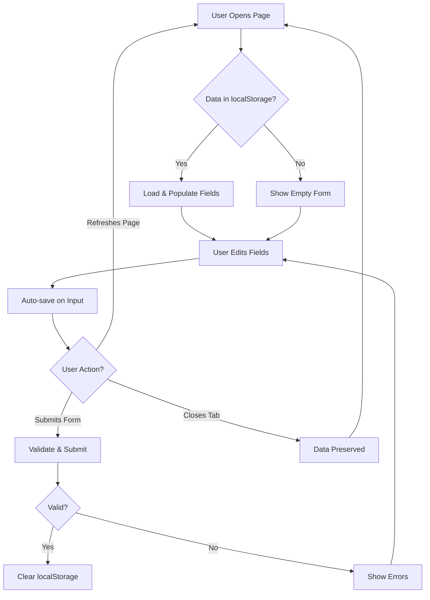

## Overview

The Club Las Aves registration form automatically saves user input to the browser's Local Storage, ensuring that form data persists even if the user accidentally closes the tab, refreshes the page, or navigates away. This provides a better user experience by preventing data loss.

## Local Storage Implementation

### Data Structure

The form data is stored as a JSON object containing all personal information fields:

```javascript app.js
const datos = {
    nombre: document.getElementById('nombre').value,
    apellido: document.getElementById('apellido').value,
    edad: document.getElementById('edad').value,
    email: document.getElementById('email').value,
    telefono: document.getElementById('telefono').value
};
```

<Note>
**What's Saved**: Only personal information fields are persisted. Sport selections, disability options, and observations are not saved to localStorage.
</Note>

## Saving Data

### Auto-Save Function

The `guardarDatos()` function collects all field values and stores them:

```javascript app.js
// GUARDAR datos automáticamente
function guardarDatos() {
    const datos = {
        nombre: document.getElementById('nombre').value,
        apellido: document.getElementById('apellido').value,
        edad: document.getElementById('edad').value,
        email: document.getElementById('email').value,
        telefono: document.getElementById('telefono').value
    };
    localStorage.setItem('formDatos', JSON.stringify(datos));
}
```

**Key operations:**
1. Create an object with current field values
2. Convert to JSON string using `JSON.stringify()`
3. Store in localStorage with key `'formDatos'`

### Triggering Auto-Save

The function is called automatically whenever any tracked field changes:

```javascript app.js
// Escuchar cambios en los inputs
document.querySelectorAll('#nombre, #apellido, #edad, #email, #telefono').forEach(input => {
    input.addEventListener('input', guardarDatos);
});
```

**Implementation details:**
- Uses `querySelectorAll()` with comma-separated selectors
- Attaches `input` event listener to each field
- Saves on every keystroke for maximum data protection

<Steps>
  <Step title="User Types">
    User enters data in any personal information field
  </Step>
  
  <Step title="Event Fires">
    The `input` event triggers on that field
  </Step>
  
  <Step title="Auto-Save Runs">
    `guardarDatos()` collects all field values
  </Step>
  
  <Step title="Data Stored">
    JSON data is saved to localStorage with key `'formDatos'`
  </Step>
</Steps>

## Loading Data

### Page Load Handler

When the page loads, saved data is automatically restored:

```javascript app.js
// CARGAR datos al abrir la página
window.addEventListener('load', function () {
    const guardado = localStorage.getItem('formDatos');
    if (guardado) {
        const datos = JSON.parse(guardado);

        // Rellenar campos
        document.getElementById('nombre').value = datos.nombre || '';
        document.getElementById('apellido').value = datos.apellido || '';
        document.getElementById('edad').value = datos.edad || '';
        document.getElementById('email').value = datos.email || '';
        document.getElementById('telefono').value = datos.telefono || '';
    }
});
```

**Load process:**
1. Retrieve JSON string from localStorage
2. Check if data exists
3. Parse JSON back to object
4. Populate each field with saved value or empty string

<Info>
**Fallback Values**: The `||` operator provides empty strings as fallback if a field wasn't saved (e.g., `datos.nombre || ''`).
</Info>

### Load Flow

<Steps>
  <Step title="Page Loads">
    Window `load` event fires when page and resources are ready
  </Step>
  
  <Step title="Check Storage">
    Attempt to retrieve `'formDatos'` from localStorage
  </Step>
  
  <Step title="Parse Data">
    If data exists, parse JSON string to object
  </Step>
  
  <Step title="Populate Fields">
    Set each input's value to the saved data
  </Step>
  
  <Step title="Ready for Editing">
    User can continue editing from where they left off
  </Step>
</Steps>

## Clearing Data

### On Successful Submission

The data is cleared from localStorage after successful form submission:

```javascript app.js
// LIMPIAR localStorage al enviar el formulario
document.getElementById('Enviar').addEventListener('click', function (e) {
    // Validation code...

    // Si todo está bien y envías:
    localStorage.removeItem('formDatos'); // Limpiar después de enviar
});
```

This prevents old data from persisting after a successful registration.

### With Reset Button

The Reset button clears form fields but doesn't explicitly clear localStorage:

```javascript app.js
// Eliminar formulario los 2 formularios y limpiar secciones no eliminadas
document.getElementById("Reset").addEventListener("click", () => {
    document.querySelectorAll("form").forEach(form => {
        form.reset();
    });

    document.querySelectorAll(".msg").forEach(msg => {
        msg.textContent = "";
    });

    document.querySelectorAll("input").forEach(input => {
        input.className = "DefaultBorder"
    });
})
```

<Warning>
**Important**: The reset button clears form fields visually, but the next `input` event will trigger `guardarDatos()` and save empty values, effectively clearing localStorage data.
</Warning>

## Local Storage API

### Core Methods

<CardGroup cols={3}>
  <Card title="setItem()" icon="floppy-disk">
    Stores data with a key
    
    ```javascript
    localStorage.setItem('key', 'value');
    ```
  </Card>
  
  <Card title="getItem()" icon="download">
    Retrieves data by key
    
    ```javascript
    const data = localStorage.getItem('key');
    ```
  </Card>
  
  <Card title="removeItem()" icon="trash">
    Deletes data by key
    
    ```javascript
    localStorage.removeItem('key');
    ```
  </Card>
</CardGroup>

### JSON Serialization

<Accordion title="Why use JSON.stringify()?">
LocalStorage only stores strings. To save objects, we convert them to JSON:

```javascript
// Saving
const obj = { name: 'Juan', age: 25 };
localStorage.setItem('user', JSON.stringify(obj));

// Loading
const saved = localStorage.getItem('user');
const obj = JSON.parse(saved);
```
</Accordion>

<Accordion title="Why use JSON.parse()?">
When retrieving data from localStorage, it returns a string. We parse it back to an object:

```javascript
const guardado = localStorage.getItem('formDatos');
const datos = JSON.parse(guardado); // Convert string → object
```
</Accordion>

## Data Persistence Lifecycle



## Storage Scope and Limits

### Scope

<Info>
**Same-Origin Policy**: localStorage is scoped to the origin (protocol + domain + port). Data is accessible across all pages on the same origin.
</Info>

### Storage Limits

- **Typical limit**: 5-10 MB per origin
- **Current usage**: ~200 bytes for the form data
- **Persistence**: Data remains until explicitly cleared by code or user

### Checking Available Space

While not implemented in this form, you can check storage usage:

```javascript
// Get approximate storage usage
function getStorageSize() {
    let total = 0;
    for (let key in localStorage) {
        if (localStorage.hasOwnProperty(key)) {
            total += localStorage[key].length + key.length;
        }
    }
    return total;
}
```

## Security Considerations

<Warning>
**Not for Sensitive Data**: localStorage is accessible via JavaScript and not encrypted. Don't store passwords, credit cards, or other sensitive information.
</Warning>

<Note>
**XSS Vulnerability**: If your site is vulnerable to XSS attacks, malicious scripts can read localStorage. Always sanitize user input.
</Note>

### What's Safe to Store

✅ **Safe:**
- Form field values (name, age, email)
- User preferences
- UI state
- Non-sensitive configuration

❌ **Unsafe:**
- Passwords
- Authentication tokens
- Credit card numbers
- Personal identification numbers

## Browser Support

The localStorage API is supported in all modern browsers:

- Chrome 4+
- Firefox 3.5+
- Safari 4+
- Edge (all versions)
- IE 8+

### Feature Detection

To check if localStorage is available:

```javascript
if (typeof(Storage) !== "undefined") {
    // localStorage supported
    localStorage.setItem('key', 'value');
} else {
    // Fallback: use cookies or session storage
    console.warn('localStorage not supported');
}
```

## Alternative Storage Options

### sessionStorage

Similar to localStorage but cleared when the browser tab is closed:

```javascript
sessionStorage.setItem('formDatos', JSON.stringify(datos));
```

### IndexedDB

For larger datasets or complex data structures:

```javascript
// More complex API, better for large datasets
const request = indexedDB.open('FormDB', 1);
```

### Cookies

For data that needs to be sent to the server:

```javascript
document.cookie = "nombre=Juan; expires=Fri, 31 Dec 2026 23:59:59 GMT";
```

<Tip>
**Best Practice**: Use localStorage for form auto-save as implemented in this project. It's simple, persistent, and doesn't require server communication.
</Tip>

## Debugging localStorage

### View Stored Data

In Chrome DevTools:
1. Open DevTools (F12)
2. Go to **Application** tab
3. Expand **Local Storage** in the sidebar
4. Select your domain
5. View the `formDatos` key and its value

### Clear localStorage

From console:

```javascript
// Clear all localStorage
localStorage.clear();

// Remove specific item
localStorage.removeItem('formDatos');
```

### Log Storage Changes

Add logging to track saves:

```javascript
function guardarDatos() {
    const datos = { /* ... */ };
    localStorage.setItem('formDatos', JSON.stringify(datos));
    console.log('Saved:', datos);
}
```
